# AnyCloud Example: WLAN Low Power

This code example demonstrates the low-power operation of a host MCU and a WLAN device using the network activity handlers provided by the [Low Power Assistant (LPA) middleware](https://github.com/cypresssemiconductorco/lpa).  

The code example connects to a configured network. After connecting to the network successfully, the example configures the WLAN device in a power-save mode, suspends the network stack, and puts the host MCU in a wait state. During this wait state, the host MCU enters a low-power state and wakes up on any network activity detected on the MAC interface.

## Requirements

- [ModusToolbox™ software](https://www.cypress.com/products/modustoolbox-software-environment) v2.1
- Programming Language: C
- Associated Parts: All [PSoC® 6 MCU](http://www.cypress.com/PSoC6) parts

## Supported Kits

- [PSoC 6 Wi-Fi BT Prototyping Kit](https://www.cypress.com/CY8CPROTO-062-4343W) (CY8CPROTO-062-4343W) - Default target
- [PSoC 62S2 Wi-Fi BT Pioneer Kit](https://www.cypress.com/CY8CKIT-062S2-43012) (CY8CKIT-062S2-43012)

## Hardware Setup

This example uses the board's default configuration. See the kit user guide to ensure that the board is configured correctly.

## Software Setup

Install a terminal emulator if you don't have one. Instructions in this document use [Tera Term](https://ttssh2.osdn.jp/index.html.en).

This example requires no additional software or tools.

## Using the Code Example

### In Eclipse IDE for ModusToolbox:

1. Click the **New Application** link in the Quick Panel (or, use **File** > **New** > **ModusToolbox Application**).

2. Pick a kit supported by the code example from the list shown in the **Project Creator - Choose Board Support Package (BSP)** dialog.

   When you select a supported kit, the example is reconfigured automatically to work with the kit. To work with a different supported kit later, use the **Library Manager** to choose the BSP for the supported kit. You can use the Library Manager to select or update the BSP and firmware libraries used in this application. 
   
   To access the Library Manager, right-click the application name from the Project Workspace window in the IDE, and select **ModusToolbox** > **Library Manager** (or select it from the **Quick Panel**).

   You can also just start the application creation process again and select a different kit.

   If you want to use the application for a kit not listed here, you may need to update the source files. If the kit does not have the required resources, the application may not work.

3. In the **Project Creator - Select Application** dialog, choose the example.

4. Optionally, update the **Application Name** and **Location** fields with the application name and local path where the application is created.

5. Click **Create** to complete the application creation process.

For more details, see the Eclipse IDE for ModusToolbox User Guide: *{ModusToolbox install directory}/ide_{version}/docs/mt_ide_user_guide.pdf*.

### In Command-line Interface (CLI):

1. Download and unzip this repository onto your local machine, or clone the repository.

2. Open a CLI terminal and navigate to the application folder. 

   On Linux and macOS, you can use any terminal application. On Windows, navigate to the modus-shell directory (*{ModusToolbox install directory}/tools_\<version>/modus-shell*) and run *Cygwin.bat*.

3. Import the required libraries by executing the `make getlibs` command.

### In Third-party IDEs:

1. Follow the instructions from the [CLI](#in-command-line-interface-cli) section to download or clone the repository, and import the libraries using the `make getlibs` command.

2. Export the application to a supported IDE using the `make <ide>` command.

3. Follow the instructions displayed in the terminal to create or import the application as an IDE project.

   For more details, see the "Exporting to IDEs" section of the ModusToolbox User Guide: *{ModusToolbox install directory}/ide_{version}/docs/mtb_user_guide.pdf*.


## Operation

1. Connect the board to your PC using the provided USB cable through the KitProg3 USB connector.

2. Modify `WIFI_SSID`, `WIFI_PASSWORD`, and `WIFI_SECURITY` macros to match with that of the Wi-Fi network credentials that you want to connect to  . These macros are defined in the *lowpower_task.h* file.

   **Note**: See the AP's configuration page for the security type. See the `cy_wcm_security_t` enumeration in *cy_wcm.h* to pass the corresponding WCM security type in the `WIFI_SECURITY`  macro.

3. Ensure that your computer is connected to the same Wi-Fi access point that you have configured in Step 2.

4. Open a terminal program and select the KitProg3 COM port. Set the serial port parameters to 8N1 and 115200 baud.

5. Program the board.

   - **Using Eclipse IDE for ModusToolbox**:

     1. Select the application project in the Project Explorer.

     2. In the **Quick Panel**, scroll down, and click **\<Application Name> Program (KitProg3)**.

   - **Using CLI**:

     From the terminal, execute the `make program` command to build and program the application using the default toolchain to the default target. You can specify a target and toolchain manually:

        ```
        make program TARGET=<BSP> TOOLCHAIN=<toolchain>
        ```
        Example:

        ```
        make program TARGET=CY8CPROTO-062-4343W TOOLCHAIN=GCC_ARM
        ```
        **Note**:  Before building the application, ensure that the *deps* folder contains the BSP file (*TARGET_xxx.lib*) corresponding to the TARGET. Execute the `make getlibs` command to fetch the BSP contents before building the application.

   After programming, the example starts automatically. The example connects to the AP and suspends the network stack.

    **Figure 1. Connect to AP and Suspend Network Stack**
    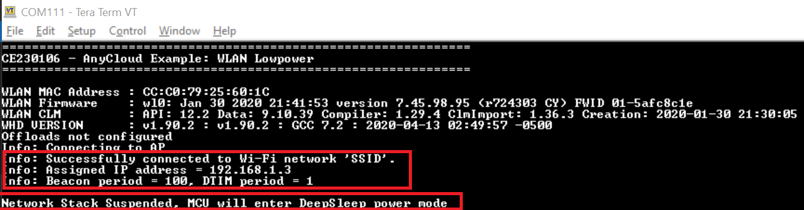

6. Open a command prompt and ping the IP address displayed on the serial terminal:

    ```
    ping <IP address>
    ```

   The network stack is resumed. The device displays the deep sleep and Wi-Fi SDIO bus statistics on the terminal as shown in Figure 2. The LED is toggled after resuming the network stack after which the network stack is again suspended until network activity is detected.

   **Note**: The host MCU will wake up on any network activity and not necessarily due to ping from the PC. The reasons for network activity could be due to the broadcast or multicast packets issued by the AP. Further power savings can be made by employing offload features like packet filtering, which will increase the time the host MCU will be in deep sleep. See [AN227910 - Low-Power System Design with CYW43012 and PSoC 6 MCU](https://www.cypress.com/documentation/application-notes/an227910-low-power-system-design-cyw43012-and-psoc-6-mcu) for more details.

    **Figure 2. Resuming Network Stack**
    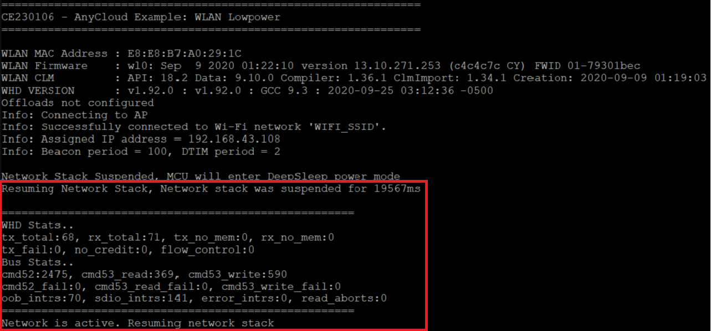

See [Measuring Current Consumption](#measuring-current-consumption) for instructions on how to measure the current consumed by the PSoC 6 MCU and the Wi-Fi devices.

## Debugging

You can debug the example to step through the code. In the IDE, use the **\<Application Name> Debug (KitProg3)** configuration in the **Quick Panel**. For more details, see the "Program and Debug" section in the Eclipse IDE for ModusToolbox User Guide: *{ModusToolbox install directory}/ide_{version}/docs/mt_ide_user_guide.pdf*.

## Design and Implementation

The example uses the lwIP network stack, which runs multiple network timers for various network-related activities. These timers need to be serviced by the host MCU. As a result, the host MCU will not be able to stay in sleep or deep sleep state longer. 

In this example, after successfully connecting to an AP, the host MCU suspends the network stack after a period of inactivity. The example uses two macros, `INACTIVE_INTERVAL_MS` and `INACTIVE_WINDOW_MS`, to determine whether the network is inactive. The network is monitored for inactivity in an interval of length `INACTIVE_INTERVAL_MS`. If the network is inactive for a continuous duration specified by `INACTIVE_WINDOW_MS`, the network stack will be suspended until there is network activity.

The host MCU is alerted by the WLAN device on network activity after which the network stack is resumed. The host MCU is in deep sleep during the time the network stack is suspended. Because there are no network timers to be serviced, the host MCU will stay in deep sleep for longer. This state where the host MCU is in deep sleep waiting for network activity is referred to as "wait state".

On the other hand, the WLAN device is configured in one of the supported power-save modes:

1. **Power-save with Poll**: This mode corresponds to (legacy) 802.11 PS-Poll mode and should be used to achieve the lowest power consumption possible when the Wi-Fi device is primarily passively listening to the network.

2. **Power-save Without Poll**: This mode attempts to increase the throughput by waiting for a timeout period before returning to sleep rather than returning to sleep immediately.

The power-save mode can be set through the `WLAN_POWERSAVE_MODE` macro. The WLAN device wakes at every DTIM interval to receive beacon frames from the AP.

For more information on low-power system design that involves offloading tasks to the WLAN device for even better power savings, see [AN227910 - Low-Power System Design with CYW43012 and PSoC 6 MCU](https://www.cypress.com/documentation/application-notes/an227910-low-power-system-design-cyw43012-and-psoc-6-mcu).

### Creating Custom Device Configuration for Low Power

This code example overrides the default device configuration provided in *<application_folder>/libs/TARGET_\<kit>/COMPONENT_BSP_DESIGN_MODUS* with the one provided in *<application_folder>/COMPONENT_CUSTOM_DESIGN_MODUS/TARGET_\<kit>* for the supported kits.  

The custom configuration disables the Phase-Locked Loop (PLL), disables the HF clock for unused peripherals like audio/USB, and configures the Buck regulator instead of the Low Dropout (LDO) regulator to power the PSoC 6 MCU device. This configuration reduces the current consumed by the PSoC 6 MCU device in active state.  

If your application uses any of the disabled peripherals, the corresponding peripherals and clocks should be enabled using the Device Configurator. Launch this tool from the **Quick Panel** inside the Eclipse IDE for ModusToolbox, or from the command line using the following command:

```
make open CY_OPEN_TYPE=device-configurator 
```

Do the following to create a custom configuration for a new kit:

1. Create a new directory inside *COMPONENT_CUSTOM_DESIGN_MODUS* with the same name as the target you are building the example for, such as *<application_folder>/COMPONENT_CUSTOM_DESIGN_MODUS/TARGET_\<kit>*.

2. Copy the contents of the *COMPONENT_BSP_DESIGN_MODUS* folder at *<application_folder>/libs/TARGET_\<kit>/COMPONENT_BSP_DESIGN_MODUS* into the folder created in the previous step except the *GeneratedSource* folder.  

   **Note**: The files *design.cycapsense* and *design.qspi* are copied so that you don't have to configure these peripherals again. All you have to do is to enable these peripherals in *design.modus* to use them.  

3. Open the copied *design.modus* file using Device Configurator.

4. On the PSoC 6 MCU **Pins** tab of the Device Configurator tool, do the following:

    - **CY8CKIT-062S2-43012**

        1. Enable the Host Wake pin **P4[1]** and name it *CYBSP_WIFI_HOST_WAKE*.

        2. In the **Parameters** pane, change the following:

            - **Drive Mode**: Analog High-Z. Input buffer off

            - **Initial Drive State**: High(1)

            - **Interrupt Trigger Type**: Rising Edge

        **Figure 3. Configuring Host Wake Pin for CY8CKIT-062S2-43012**
        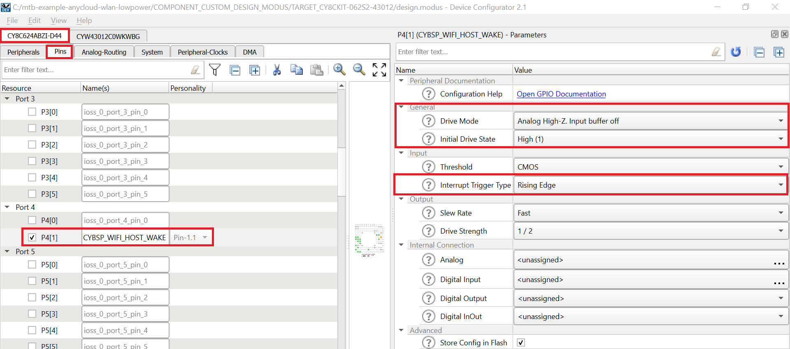

    - **CY8CPROTO-062-4343W**

        1. Enable the Host WAKE pin **P0[4]**, and name it as *CYBSP_WIFI_HOST_WAKE*.

        2. In the **Parameters** pane, change the following:

            - **Drive Mode**: Analog High-Z. Input buffer off

            - **Initial Drive State**: High(1)

            - **Interrupt Trigger Type**: Rising Edge

        **Figure 4. Configuring Host Wake Pin for CY8CPROTO-062-4343W**
        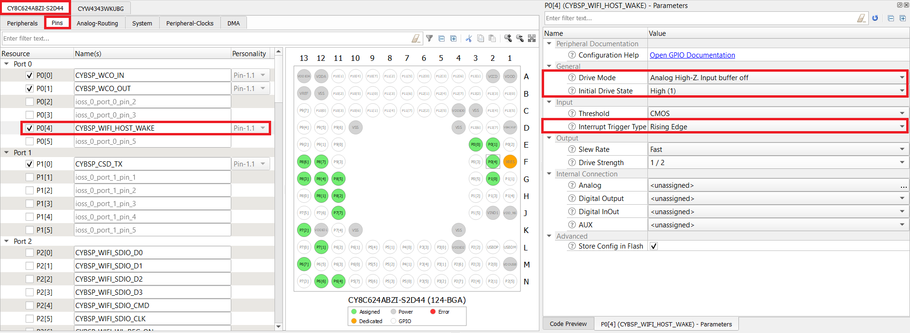

   **Note:** The Wi-Fi host driver takes care of the drive mode configuration of the Host WAKE pin.

5. Go to the **Wi-Fi** tab and enable the Host Wake Configuration and set **Host Device Interrupt Pin** to **CYBSP_WIFI_HOST_WAKE**. This configuration is applicable to all [supported kits](#supported-kits).

    **Figure 5. Enable Host Wake Pin**
    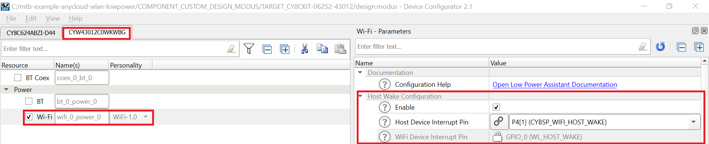


4. Switch to the **System** tab, expand the **System Clocks** resource, and do the following:
   1. Uncheck the box in the **FLL+PLL** section to disable the PLL.

   2. In the **High Frequency** section, disable HF clocks for the peripherals that are not being used in this code example.

   The kit-specific changes are listed below.:

    **CY8CKIT-062S2-43012**:

    1. Disable PLL0 and PLL1, and High-Frequency Clocks CLK_HF2 and CLK_HF3.

    2. PLL is the source clock for CLK_HF0. After disabling the PLL, change the source clock for CLK_HF0 to **FLL**. 

       **Figure 6. Clock Settings in CY8CKIT-062S2-43012**
       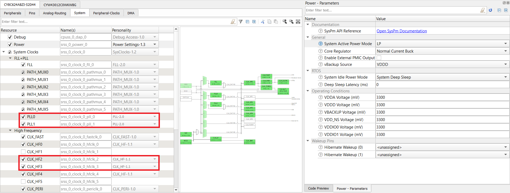

    3. In the **System Clocks** resource, select **CLK_HF0** and modify the **Source Clock** to **CLK_PATH0**. 

    **Figure 7. CLK_HF0 Settings for CY8CKIT-062S2-43012**
    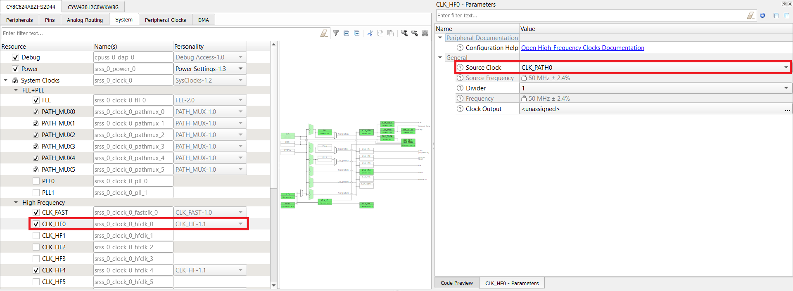

    **CY8CPROTO-062-4343W**:

    1. Disable PLL1 and High-Frequency Clocks CLK_HF2 & CLK_HF3.

    **Figure 8. Clock Settings in CY8CPROTO-062-4343W**
    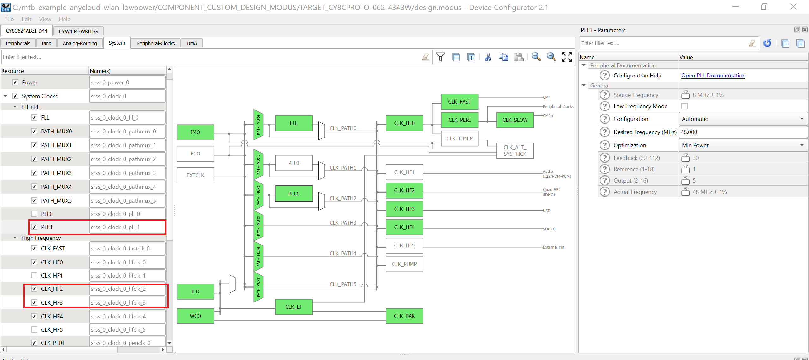

5. Under the **Power** resource, change the **Core Regulator** under **General** to **Buck**.

    **Figure 9. Configuring Core Regulator as Buck**
    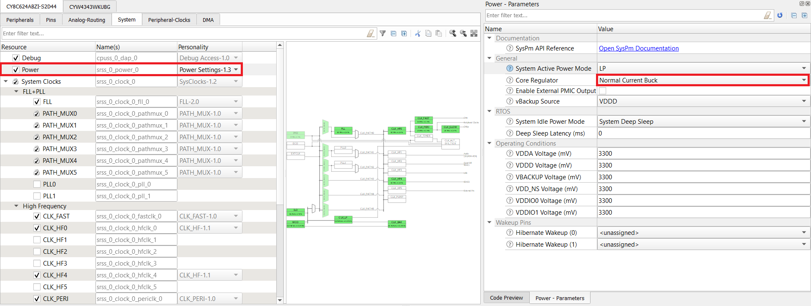

6. Optionally, you can make higher power savings by switching to ULP mode. However, this mode requires the CM4 CPU to be limited to a maximum operating frequency of 50 MHz.

    **CY8CPROTO-062-4343W**:
    1. Under the **Power** resource, change the **System Active Power Mode** under **General** to **ULP**.
    
       Note that switching to ULP causes a few warnings to appear for FLL and CLK_PERI because their frequencies are greater than 50 MHz and 25 MHz respectively.

       **Figure 10. Configuring System Active Power Mode**
       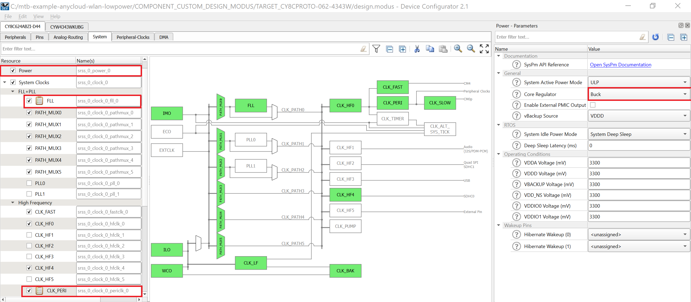

    2. Under the **System** tab, expand the **System Clocks** resource, select **FLL**, and modify the **Desired Frequency** to **50.000 MHz**.

        **Figure 11. FLL Settings**
        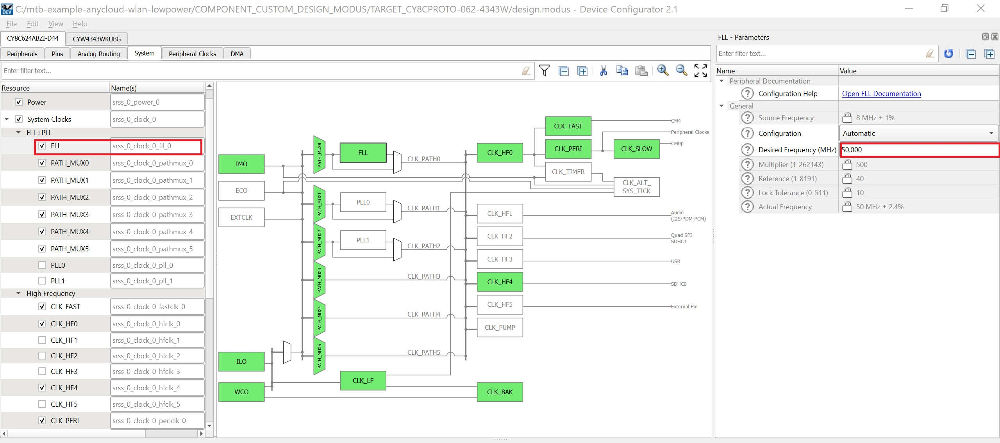

    3. In the **System Clocks** resource, select **CLK_PERI** and modify the **Divider** to **2**.

        **Figure 12. CLK_PERI Settings**
        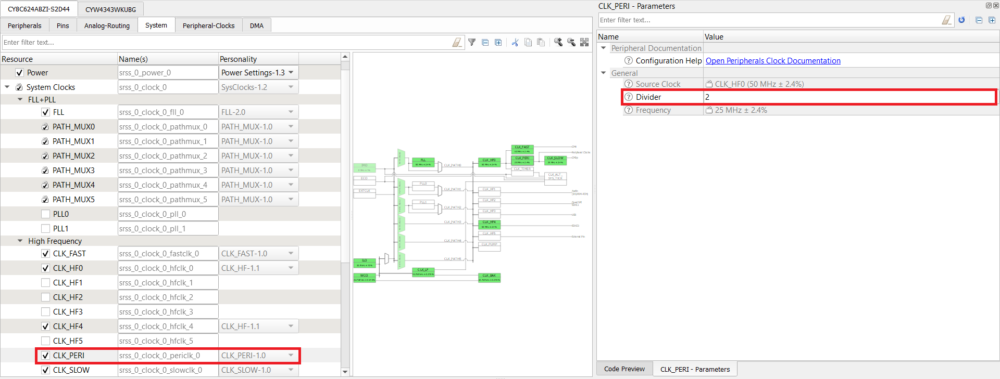

    **CY8CKIT-062S2-43012**:
    1. Under the **Power** resource, change the **System Active Power Mode** under **General** to **ULP**. 
    
       Note that switching to ULP causes a warning to appear for FLL and CLK_PEI because their frequencies are greater than 50 MHz and 25 MHz respectively.

       **Figure 13. Configuring System Active Power Mode**
        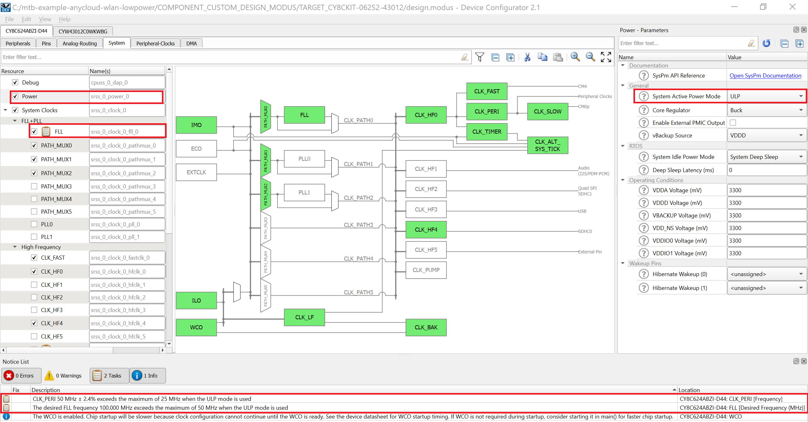

    2. Under the **System** tab, expand the **System Clocks** resource, select **FLL**, and modify the **Desired Frequency** to **50.000 MHz**.

        **Figure 14. FLL Settings**
        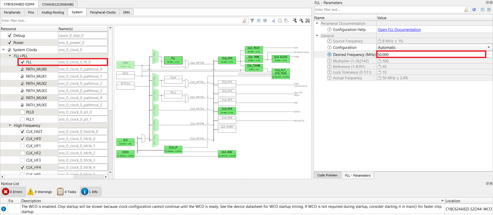

7. Save the file to generate the source files.

8. Disable the default configuration and enable the custom configuration by making the following changes in *Makefile*:

   ```
   DISABLE_COMPONENTS += BSP_DESIGN_MODUS
   COMPONENTS += CUSTOM_DESIGN_MODUS
   ```
   **Note**: Refer to the schematic to find the LED which is not powered directly by *P6_VDD*. If the LED is directly connected to P6_VDD, the current consumed by the LED will be added to the current measurement of the PSoC 6 MCU device. Find the corresponding macro for that LED in *cybsp_types.h* at *<application_folder>/libs/TARGET_\<kit>/cybsp_types.h*. Provide that macro as the value for `USER_LED` in *lowpower_task.h*.

## Measuring Current Consumption

### CY8CKIT-062S2-43012

**For PSoC 6 MCU**: 
   1. Remove J25 to eliminate leakage currents across the potentiometer R1.
   
   2. Measure the current at J15 across VTARG and P6_VDD.  

**For CYW43012**: 
   1. Measure the current at supplies VDDIO_WL used for SDIO communication interface, and at VBAT used for powering CYW43xxx. 

   2. Measure at VDDIO_WL across VDDIO_WL and VCC_VDDIO2 at J17.

   3. Measure at VBAT across VBAT and VCC_VBAT at J8. 
   

### CY8CPROTO-062-4343W

**For PSoC 6 MCU**: 
   1. Remove R65 on the right of the board close to the USB connector of the PSoC 6 MCU device.

   2. Connect an ammeter between VTARG (J2.32) and P6_VDD (J2.24). 

   3. Remove R24 at the back of the board, below J1.9, to eliminate the leakage current. 

      R24 is the pull-up resistor attached to the WL_HOST_WAKE pin P0_4, which leaks approximately 330 uA because P0_4 is driven LOW when there is no network activity. In total, the PSoC 6 MCU deep sleep current is approximately 350 uA. 

**For CYW4343W**: 

Measure the current at the VDDIO_1LV supply used for SDIO communication interface, and at VBAT1 and VBAT2 supplies used for powering CYW4343W. VBAT1 and VABT2 are shorted to each other. 

1. Remove R87 on the back of the board towards the right and above J2.33. 
   
2. Connect an ammeter between the pads of R87 to measure the current.

3. Measure the current at VDDIO_1LV:

   1. Remove the resistor R86  on the back of the board, below J1.27. 
   
   2. Connect an ammeter between the pads of R86 to measure the current. 

Note that the current at VDDIO_1LV will depend on the SDIO transactions that happen because of the pull-up resistors on the lines to VDDIO_1LV. Also, VDDIO_1LV (named VDDIO_1DX in the carrier module (CY8CMOD_062_4343W) schematic) allows a current of 38 uA through R24 because WL_HOST_WAKE is LOW. This current needs to be deducted from the observed value of VDDIO_1LV.

## Reference Documents

| Application Notes                                            |                                                              |
| :----------------------------------------------------------- | :----------------------------------------------------------- |
| [AN228571](https://www.cypress.com/AN228571) – Getting Started with PSoC 6 MCU on ModusToolbox | Describes PSoC 6 MCU devices and how to build your first application with ModusToolbox |
| [AN227910](http://www.cypress.com/AN227910) – Low-Power System Design with PSoC 6 MCU and CYW43012 | Describes how to implement a low-power system design.        |
| **Code Examples**                                            |                                                              |
| [Using ModusToolbox](https://github.com/cypresssemiconductorco/Code-Examples-for-ModusToolbox-Software) | [Using PSoC Creator](https://www.cypress.com/documentation/code-examples/psoc-6-mcu-code-examples) |
| **Device Documentation**                                     |                                                              |
| [PSoC 6 MCU Datasheets](http://www.cypress.com/search/all?f[0]=meta_type%3Atechnical_documents&f[1]=resource_meta_type%3A575&f[2]=field_related_products%3A114026) | [PSoC 6 MCU Technical Reference Manuals](https://www.cypress.com/search/all/PSoC%206%20Technical%20Reference%20Manual?f[0]=meta_type%3Atechnical_documents&f[1]=resource_meta_type%3A583) |
| **Development Kits**                                         | Buy at www.cypress.com                                     |
| [CY8CKIT-062S2-43012 PSoC 62S2 WiFi-BT Pioneer Kit](http://www.cypress.com/CY8CKIT-062-BLE) |[CY8CPROTO-062-4343W PSoC 6 Wi-Fi BT Prototyping Kit](http://www.cypress.com/cy8cproto-062-4343w)|
| **Libraries**                                                |                                                              |
| PSoC 6 Peripheral Driver Library (PDL) and docs | [psoc6pdl](https://github.com/cypresssemiconductorco/psoc6pdl) on GitHub |
| Cypress Hardware Abstraction Layer Library (HAL) and docs          | [psoc6hal](https://github.com/cypresssemiconductorco/psoc6hal) on GitHub |
| **Middleware**                                               | Middleware libraries are distributed on GitHub               |
| Low Power Assistant (LPA)  | [lpa](https://github.com/cypresssemiconductorco/lpa) on GitHub |
| Wi-Fi Connection Manager (WCM)                                    | [wifi-connection-manager](https://github.com/cypresssemiconductorco/wifi-connection-manager) on GitHub |
| Wi-Fi Middleware Core                                             | [wifi-mw-core](https://github.com/cypresssemiconductorco/wifi-mw-core) on GitHub|
| Connectivity-Utilities                                    | [connectivity-utilities](https://github.com/cypresssemiconductorco/connectivity-utilities) on GitHub |
| Links to all PSoC 6 MCU Middleware                               | [psoc6-middleware](https://github.com/cypresssemiconductorco/psoc6-middleware) on GitHub |
| **Tools**                                                    |                                                              |
| [Eclipse IDE for ModusToolbox](https://www.cypress.com/modustoolbox)     | The multi-platform, Eclipse-based Integrated Development Environment (IDE) that supports application configuration and development for PSoC 6 MCU and IoT designers.             |
| [PSoC Creator](https://www.cypress.com/products/psoc-creator-integrated-design-environment-ide) | The Cypress IDE for PSoC and FM0+ MCU development.            |

Cypress provides a wealth of data at www.cypress.com to help you to select the right device, and quickly and effectively integrate it into your design.

For PSoC 6 MCU devices, see [How to Design with PSoC 6 MCU - KBA223067](https://community.cypress.com/docs/DOC-14644) in the Cypress community.


## Document History

Document Title: CE230106 - AnyCloud Example: WLAN Low Power

| Version | Description of Change |
| ------- | --------------------- |
| 1.0.0   | New code example      |

------

All other trademarks or registered trademarks referenced herein are the property of their respective owners.


-------------------------------------------------------------------------------

© Cypress Semiconductor Corporation, 2020. This document is the property of Cypress Semiconductor Corporation and its subsidiaries ("Cypress"). This document, including any software or firmware included or referenced in this document ("Software"), is owned by Cypress under the intellectual property laws and treaties of the United States and other countries worldwide. Cypress reserves all rights under such laws and treaties and does not, except as specifically stated in this paragraph, grant any license under its patents, copyrights, trademarks, or other intellectual property rights. If the Software is not accompanied by alicense agreement and you do not otherwise have a written agreement with Cypress governing the use of the Software, then Cypress hereby grants you a personal, non-exclusive, nontransferable license (without the right to sublicense) (1) under its copyright rights in the Software (a) for Software provided in source code form, to modify and reproduce the Software solely for use with Cypress hardware products, only internally within your organization, and (b) to distribute the Software in binary code form externally to end users (either directly or indirectly through resellers and distributors), solely for use on Cypress hardware product units, and (2) under those claims of Cypress's patents that are infringed by the Software (as provided by Cypress, unmodified) to make, use, distribute, and import the Software solely for use with Cypress hardware products. Any other use, reproduction, modification, translation, or compilation of the Software is prohibited.
TO THE EXTENT PERMITTED BY APPLICABLE LAW, CYPRESS MAKES NO WARRANTY OF ANY KIND, EXPRESS OR IMPLIED, WITH REGARD TO THIS DOCUMENT OR ANY SOFTWARE OR ACCOMPANYING HARDWARE, INCLUDING, BUT NOT LIMITED TO, THE IMPLIED WARRANTIES OF MERCHANTABILITY AND FITNESS FOR A PARTICULAR PURPOSE. No computing device can be absolutely secure. Therefore, despite security measures implemented in Cypress hardware or software products, Cypress shall have no liability arising out of any security breach, such as unauthorized access to or use of a Cypress product. CYPRESS DOES NOT REPRESENT, WARRANT, OR GUARANTEE THAT CYPRESS PRODUCTS, OR SYSTEMS CREATED USING CYPRESS PRODUCTS, WILL BE FREE FROM CORRUPTION, ATTACK, VIRUSES, INTERFERENCE, HACKING, DATA LOSS OR THEFT, OR OTHER SECURITY INTRUSION (collectively, "Security Breach"). Cypress disclaims anyliability relating to any Security Breach, and you shall and hereby do release Cypress from any claim, damage, or other liability arising from any Security Breach. In addition, the products described in these materials may contain design defects or errors known as errata which may cause the product to deviate from published specifications. To the extent permitted by applicable law, Cypress reserves the right to makechanges to this document without further notice. Cypress does not assume any liability arising out of the application or use of any product or circuit described in this document. Any information provided in this document, including any sample design information or programming code, is provided only for reference purposes. It is the responsibility of the user of this document to properly design, program, and test thefunctionality and safety of any application made of this information and any resulting product. "High-Risk Device" means any device or system whose failure could cause personal injury, death, or property damage. Examples of High-Risk Devices are weapons, nuclear installations, surgical implants, and other medical devices. "Critical Component" means any component of a High-Risk Device whose failure to perform can be reasonably expected to cause, directly or indirectly, the failure of the High-Risk Device, or to affect its safety or effectiveness. Cypress is not liable, in whole or in part, and you shall and hereby do release Cypress from any claim, damage, or other liability arising from any use of a Cypress product as a Critical Component in a High-Risk Device. You shall indemnify and hold Cypress, its directors, officers, employees, agents, affiliates, distributors, and assigns harmless from and against all claims, costs, damages, and expenses, arising out of any claim, including claims for product liability, personal injury or death, or property damage arising from any use of a Cypress product as a Critical Component in a High-Risk Device. Cypress products are not intended or authorized for use as a Critical Component in any High-Risk Device except to the limited extent that (i) Cypress's published data sheet for the product explicitly states Cypress has qualified the product for use in a specific High-Risk Device, or (ii) Cypress has given you advance written authorization to use the product as a Critical Component in the specific High-Risk Device and you have signed a separate indemnification agreement.
Cypress, the Cypress logo, Spansion, the Spansion logo, and combinations thereof, WICED, PSoC, CapSense, EZ-USB, F-RAM, and Traveo are trademarks or registered trademarks of Cypress in the United States and other countries. For a more complete list of Cypress trademarks, visit cypress.com. Other names and brands may be claimed as property of their respective owners.
